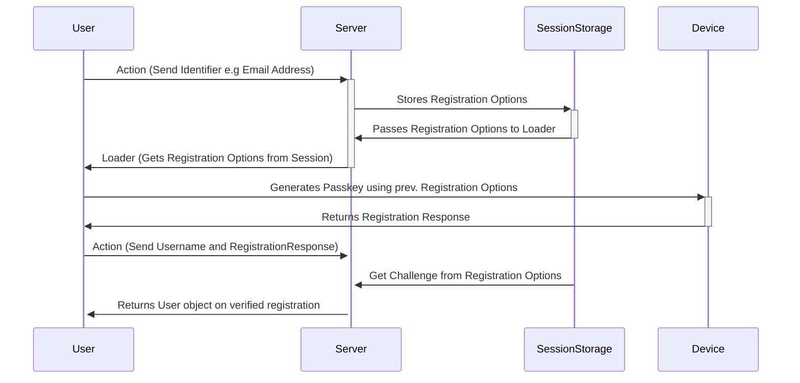

# Remix Auth WebAuthn

This strategy for Remix Auth provides WebAuthn support for authenticating users. It uses the [WebAuthn API](https://developer.mozilla.org/en-US/docs/Web/API/Web_Authentication_API) to register and authenticate users based on the [SimpleWebAuthn](https://simplewebauthn.dev/) library.

# Understanding WebAuthn

> **Note**
> This section is still under construction.

# Installation

> **Note**
> This section is still under construction.
